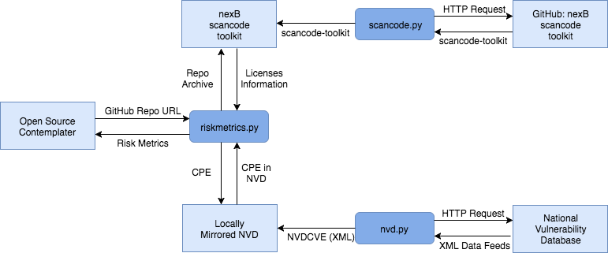

## System Description
RiskMetrics provides risk management metrics for any given github repository. It utilizes nexB's [scancode-toolkit](https://github.com/nexB/scancode-toolkit) to scan a repository's files for license information (i.e., how many files are licensed, what types of licenses are used, etc.). RiskMetrics also constructs and checks the repository's software package’s [Common Platform Enumeration (CPE)](https://scap.nist.gov/specifications/cpe/) against the [National Vulnerability Database (NVD)](https://nvd.nist.gov). Presence in this database indicates a documented security vulnerability within the software package.

### Use Case
- _Title:_ Provide Risk Management Metrics on Software Package
- _Primary Actor:_ Open Source Contemplator (someone interested in utilizing OSS)
- _Goal in Context:_ Provide metrics for determination of risk in any given software package
- _Stakeholders:_ Open Source Contemplator, Software Package Vendor
- _Preconditions_ Software package is present in system
- _Main Success Scenario:_ Software package is analyzed and results outputted
- _Failed End Conditions:_ Software package fails to be analyzed
- _Trigger:_ Executes ./start.sh and provides software package

## Dependencies
* [Python 2.7.x](https://www.python.org/download/releases/2.7/)
* [virtualenv 15.0.1+](https://virtualenv.pypa.io/en/stable/)
* [scancode-toolkit-1.6.0](https://github.com/nexB/scancode-toolkit) (this will be automatically installed during usage)

## Installation
### Ubuntu 16.04.2+ (with at least 3 GB Ram)
0. [Python 2.7](https://www.python.org/download/releases/2.7/) ships with Ubuntu 16
1. Install [virtualenv 15.0.1+](https://virtualenv.pypa.io/en/stable/)
   * `sudo apt install virtualenv`
2. In a Terminal, set your working directory where you want to install RiskMetrics
3. In that directory, run `git clone https://github.com/hacksmath/RiskMetrics.git`
   * If git is not installed, intall git with `sudo apt install git` or manually download RiskMetrics
4. Create a virtualenv to install python dependencies with `virtualenv env`
5. Activate the virtualenv with `source env/bin/activate`
6. Install python dependencies with pip `pip install -r requirements.txt`
   * This will install [requests](http://docs.python-requests.org/en/master/) and [pytest](https://docs.pytest.org/en/latest/) in the virtualenv

## Usage
1. In the RiskMetrics directory, run `python riskmetrics/riskmetrics.py <github-repo-url>`
   * ScanCode and the NVD will be automatically downloaded and configured as necessary.
2. The results will be displayed on the Terminal 

## Development Environment
Development is currently being performed on macOS Sierra and Windows 10 using Python 2.7. See developement setup instructions in riskmetrics for more information on how to start developing.

Those interested in contributing should contact Micah (mswab@unomaha.edu) or Kiet (khtran@unomaha.edu).

## Test Cases
To execute unit tests, run command `pytest`

### Data Flow Diagram

### Database Schema
This section is intentionally empty as no generated data is currently being cached.

### License & Copyright Declarations

RiskMetrics source code licensed under MIT.

Documents licensed under CC BY-SA 4.0.

All work copyright © Micah Swab, Kiet Tran 2017.
