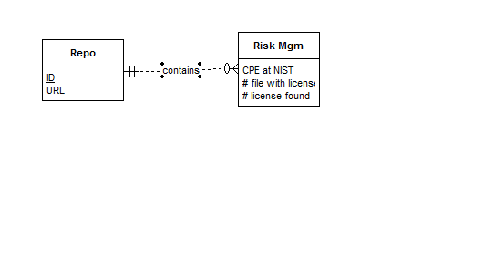

System Description:
GHRiskMetrics is a planned contribution to GHData that will provide metrics such as source code licenses and potential code vulnerabilities. It will connect to NOMOS, the license scanner behind FOSSology, to gather detailed license information on GitHub repositories. GHRiskMetrics will also calculate the provided software package’s Common Platform Enumeration (CPE) and check to see if it is found in the National Vulnerability Database (NVD).

Development Environment:
Development is being performed in Python.
Project collaborators can commit freely. But please keep the other collaboarators in the loop for big changes.
Non-collaborators interested in contributing should contact Micah (mswab@unomaha.edu) or Kiet (ktran@unomaha.edu)

Data Flow Diagram: n/a

Database Schema: 

Documents licensed under Creative Commons Attribution-ShareAlike 4.0 International Public License.

Source code licensed under MIT.

All work copyright © Micah Swab and Kiet Tran 2017.
